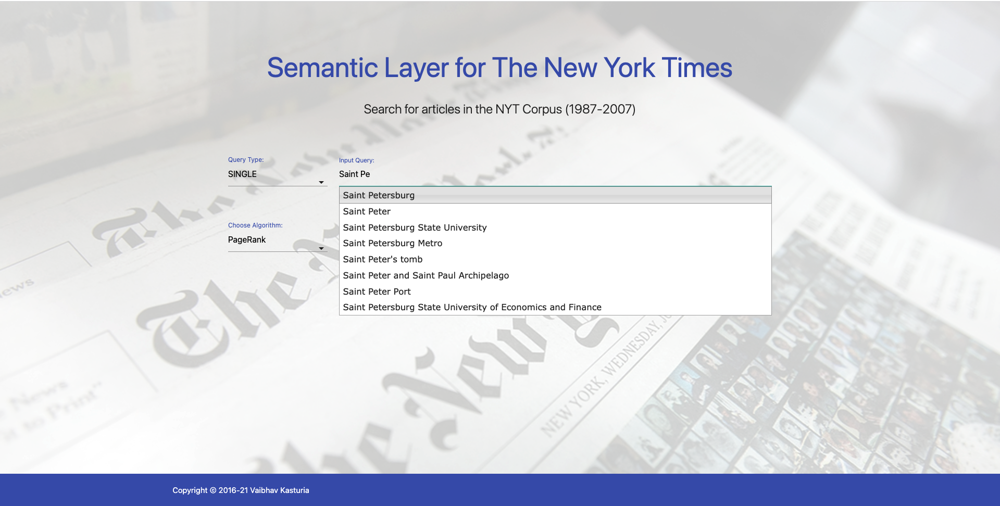

# Demonstration - Semantic Layer for the New York Times

A simple demo of the query capabilities of Semantic Layers. The triples dataset for New York Times are loaded in a [Virtuoso Triple Store](https://virtuoso.openlinksw.com/). [SemLayerFrontend](https://github.com/vkasturia/semantic-layers/tree/master/Demonstration/SemLayerFrontend) contains the code for the Front-end. A REST endpoint has been built on the Backend code with [Spark Java Microframework](https://sparkjava.com/). The class [SemanticLayerSparkApplication](https://github.com/vkasturia/semantic-layers/blob/master/Demonstration/SemLayerFunctions/src/main/java/l3s/de/spark/SemanticLayerSparkApplication.java) serves as entry-point for the Back-end. 

## Environment Configuration for Front-end

1. Install `pip`
```
curl https://bootstrap.pypa.io/get-pip.py -o get-pip.py
python3 get-pip.py
```

2. Install and activate `virtualenv`
```
pip install virtualenv
virtualenv -p python3 venv
source venv/bin/activate
```

3. Install `requests, flask, unicodedata` 
```
pip install requests
pip install flask
pip install unicodedata
```

4. Run the Application
```
python3 app.py
```
## Usage of the Front-end

A characteristic of Semantic Layers is Robustness (to information change). You can explore a web archive by automatically taking into account the
change of entities over time. For example, the company [Accenture](https://en.wikipedia.org/wiki/Accenture) was formerly known as Andersen Consulting, or the city [Saint Petersburg](https://en.wikipedia.org/wiki/Saint_Petersburg) was named Leningrad until 1991. Such temporal reference variants are common in the case of high impact events, new technologies, role changes, etc. 

We can find Documents from the past about such entities without having to worry about their correct reference. In the example below where we try to find articles mentioning Saint Petersburg at the time when it was still known as Leningrad.  



For the ranking algorithm one can either choose from the Statistical or PageRank-like approach as described in the publications below. For the PageRank-like approach, one can select between different Decay Factors. 


The result is an list of articles ranked by their importance which have inside them Saint Petersburg mentioned as Leningrad. 


The search engine can also be used for finding documents related to:

* **Single-entity queries**: Queries requesting articles related to 1 entity (e.g., articles of 1990 discussing about
Nelson Mandela).

* **Multiple-entity AND queries**: Queries requesting articles related to 2 or more entities with logical AND semantics (e.g., articles of 1990 discussing about Nelson Mandela and F.W. de Klerk).

* **Multiple-entity OR queries**: Queries requesting articles related to 2 or more entities with logical OR semantics (e.g., articles of 1990 discussing about Nelson Mandela or F.W. de Klerk).

* **Category queries**: Queries requesting articles related to entities belonging to a DBpedia category (e.g., articles of 1990 discussing about presidents of South Africa). This category is a special case of multiple-entity OR queries where the number of entities can be very large (hundreds or even thousands).

More information (use cases, examples, etc.) can be found in the following publications:

> Pavlos Fafalios, Helge Holzmann, Vaibhav Kasturia, and Wolfgang Nejdl. *Building and Querying Semantic Layers for Web Archives*. In Proceedings of the 17th ACM/IEEE Joint Conference on Digital Libraries (pp. 11-20). IEEE Press. 2017.

> Pavlos Fafalios, Helge Holzmann, Vaibhav Kasturia, and Wolfgang Nejdl. *Building and Querying Semantic Layers for Web Archives (Extended Version)*. International Journal on Digital Libraries, Springer. 2018

> Pavlos Fafalios, Vaibhav Kasturia, and Wolfgang Nejdl. *Ranking Archived Documents for Structured Queries on Semantic Layers*. In Proceedings of the 18th ACM/IEEE Joint Conference on Digital Libraries (pp. 155-164). ACM. 2018.
