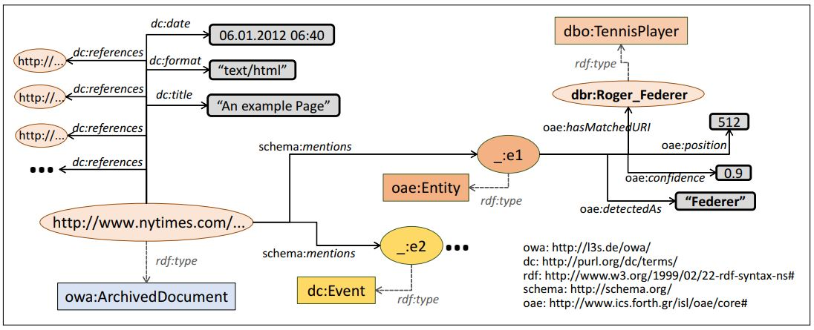
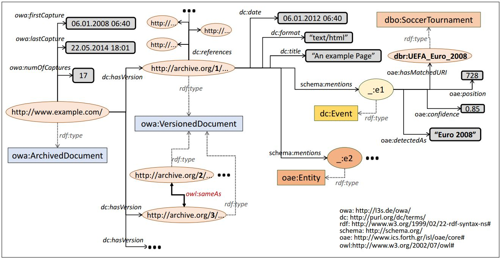
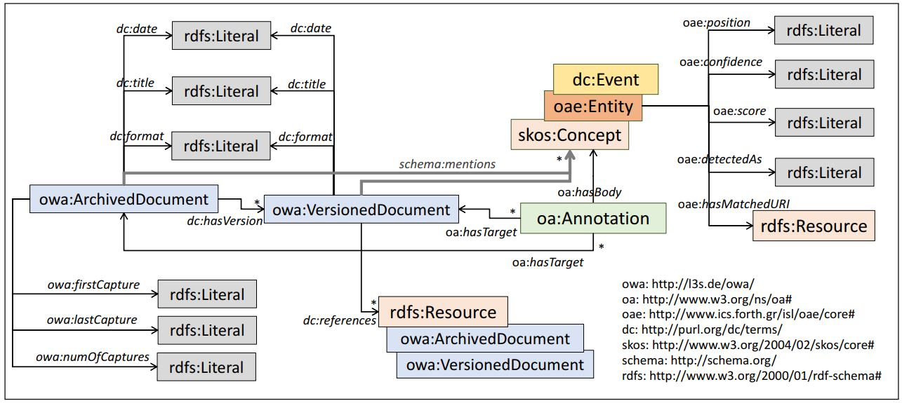

# Semantic Layers

## What is a Semantic Layer?

A Semantic Layer is an RDF repository (RDF graph) of structured data about a collection of archived documents. Structured data includes not only metadata information about a document (like publication date), but also entity annotations, i.e., disambiguated entities mentioned in each document extracted using an [entity linking](https://en.wikipedia.org/wiki/Entity_linking) system.

The following figure shows an example of (a part of) a Semantic Layer describing metadata and annotation information for a news article (non-versioned). We see that the document was published on 6 January 2012 and mentions the entity name “Giuliani” at character position 512, which probably (with confidence score 0.9/1.0) corresponds to the known American lawyer and former politician Rudy Giuliani. By accessing [DBpedia](https://www.dbpedia.org/), we can now retrieve more information about this entity like its birth date, an image, a description in a specific language, etc.



The below figure shows an example of an archived web page containing versions. Now, each version has its own metadata, annotations and references to other web pages. We notice that the event name “Euro 2008” was identified in the first version of the archived document and was linked to the DBpedia resource corresponding to the soccer tournament UEFA Euro 2008. The archived document is also associated with metadata information related to its versions. We can see the date of its first capture, the date of its last capture and its total number of captures. In addition, by exploiting the same-as property of [OWL Web ontology language](https://www.w3.org/OWL/), we can define that a specific version of a URL is the same as another version (e.g., versions 2 and 3 in our example). Thereby, we can avoid storing exactly the same data for two identical versions (redundancy is a common problem in web archives).



The RDF schema used for describing the data is called Open Web Archive and is depicted in the following figure:



The specification is available at: http://l3s.de/owa/

A semantic layer allows running advanced, entity-centric queries that can also directly integrate information from other knowledge bases. The below SPARQL query can be answered by a semantic layer over a collection of old news articles.

```
SELECT ?article ?title ?date ?nylawyer ?bdate WHERE {
  SERVICE <http://dbpedia.org/sparql> {
    ?nylawyer dc:subject dbc:New_York_lawyers ; dbo:birthPlace dbr:Brooklyn .
    OPTIONAL { ?nylawyer dbo:birthDate ?bdate } }
  ?article dc:date ?date FILTER(year(?date) = 1989) .
  ?article schema:mentions ?entity .
  ?entity oae:hasMatchedURI ?nylawyer .
  ?article dc:title ?title
} ORDER BY ?nylawyer
```

The query requests articles of 1989 mentioning New York lawyers born in Brooklyn. By accessing DBpedia at query-execution time, the query retrieves the entities that satisfy the query as well as additional information, in particular the birth date of each lawyer. We see that, using the entity URIs and type/category information, we can find documents about entities even if we do not know the names of the entities, or without needing to specify a long list of all the entity names.

More information (use cases, examples, etc.) can be found in the following publications:

> Pavlos Fafalios, Helge Holzmann, Vaibhav Kasturia, and Wolfgang Nejdl. *Building and Querying Semantic Layers for Web Archives*. In Proceedings of the 17th ACM/IEEE Joint Conference on Digital Libraries (pp. 11-20). IEEE Press. 2017.

> Pavlos Fafalios, Helge Holzmann, Vaibhav Kasturia, and Wolfgang Nejdl. *Building and Querying Semantic Layers for Web Archives (Extended Version)*. International Journal on Digital Libraries, Springer. 2018

> Pavlos Fafalios, Vaibhav Kasturia, and Wolfgang Nejdl. *Ranking Archived Documents for Structured Queries on Semantic Layers*. In Proceedings of the 18th ACM/IEEE Joint Conference on Digital Libraries (pp. 155-164). ACM. 2018.

## Available Semantic Layers

We have created three semantic layers for three different types of archives:

* **news archive** (non-versioned)
* **web archive** (versioned)
* **social media archive** (tweets)

### News Archive: Semantic Layer for the New York Times 1987-2007 corpus
The corpus contains over 1.8 million articles published by New York Times between 1987 and 2007. We filtered out articles like memorial notices, corrections, letters, captions, etc. which actually are not articles. This reduced the number of articles to 1,456,896. The semantic layer contains totally 195,958,390 triples.

SAMPLE FILE
FULL DATASET

### Web Archive: Semantic Layer for the Occupy Movement Archive-It collection
The collection contains 9,094,573 captures of 3,036,326 web pages related to protests and demonstrations around the world calling for social and economic equality. The semantic layer was constructed using the ArchiveSpark2Triples framework and contains totally more than 10 billion triples (10,884,509,868).

SAMPLE FILE
FULL DATASET

### Social Media Archive: Semantic Layer for a collection of tweets
The collection comprises 1,363,487 tweets posted in 2016 by 469 twitter accounts of USA newspapers. The semantic layer contains totally 19,242,761 triples.

SAMPLE FILE
FULL DATASET


